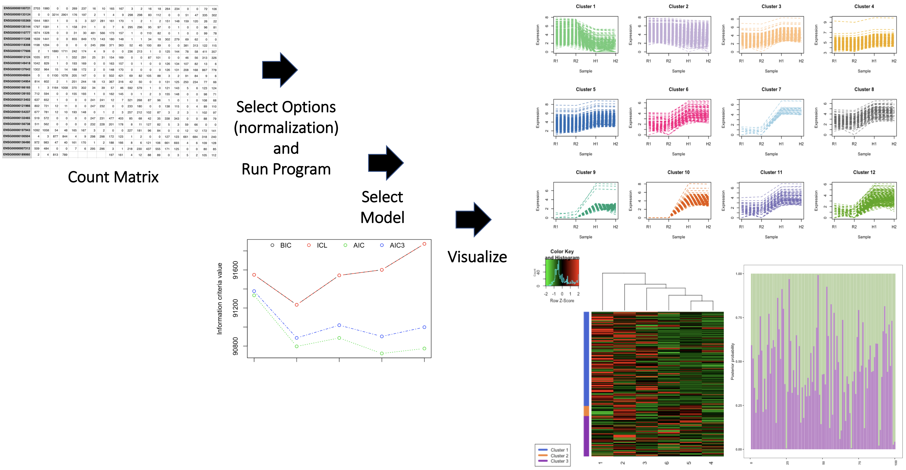

<!-- README.md is generated from README.Rmd. Please edit that file -->

# TestingPackage

An Example R Package For BCB410H: Applied Bioinformatics.

<!-- badges: start -->
<!-- https://www.codefactor.io/repository/github/anjalisilva/testingpackage/issues -->

[](https://www.codefactor.io/repository/github/anjalisilva/testingpackage)
[](https://github.com/anjalisilva/TestingPackage/issues)
[](./LICENSE)


<!-- https://shields.io/category/license -->
<!-- badges: end -->

## Description

A paragraph that describes the purpose of your R package and biological
data being analyzed. Explain how your package add to or improve a
current work flow in bioinformatics or computational biology (i.e., how
is it unique?, what issue does it address?). Finally, include the R
version (not RStudio version) and platform (Mac, Windows, Linux (Debian,
Fedora/Redhat, Ubuntu)), used to develop the package. You may obtain
this information by running `utils::sessionInfo()`. There should be no
`Shiny` implementation at this point. E.g., <br> <br> <br>
`TestingPackage` is an R package to demonstrate components of a simple R
package with RNA sequencing data. The R package includes the main
components: DESCRIPTION, NAMESPACE, man subdirectory and R subdirectory.
Additionally, LICENSE, README and subdirectories vignettes, tests, data
and inst are also explored. The package is targeted for BCB410H (Applied
Bioinformatics) students, who are to define a useful tool for the
analysis of biological data in the format of a public R package housed
on GitHub. The scope of the R package is to add to or improve a current
work flow in bioinformatics or computational biology. The tool should
contain functions to perform analysis of biological data and to produce
a compelling graphical output, ideally to support for exploratory
analysis. The `TestingPackage` package was developed using
`R version 4.2.1 (2022-06-23)`,
`Platform: x86_64-apple-darwin17.0 (64-bit)` and
`Running under: macOS Ventura 13.2`.

## Installation

Provide the following text and commands, customized to your R package.
E.g., <br> <br> <br> To install the latest version of the package:

``` r
install.packages("devtools")
library("devtools")
devtools::install_github("anjalisilva/TestingPackage", build_vignettes = TRUE)
library("TestingPackage")
```

To run the Shiny app:

``` r
runTestingPackage() # not for Assessment 4; only for Assessment 5
```

## Overview

Provide the following commands, customized to your R package. Then
provide a list of user accessible functions within the package and a
brief description of each. Include one image illustrating the overview
of the package that shows the inputs and outputs. Ensure the image is
deposited in the correct location, as discussed in class. Point the user
to vignettes for a tutorial of your package. E.g., <br> <br> <br>

``` r
ls("package:TestingPackage")
data(package = "TestingPackage") 
browseVignettes("TestingPackage")
```

`TestingPackage` contains 3 functions.

1.  ***InfCriteriaCalculation*** for calculating information criteria
    given dataset dimensions, log-likelihood and probability.

2.  ***NormFactors*** for calculating normalization factors via via
    trimmed mean of M-values (TMM).

3.  ***InfCriteriaPlot*** for plotting information criteria values as a
    scatter plot.

The package also contains two RNA sequencing datasets, called GeneCounts
and GeneCounts2. Refer to package vignettes for more details. An
overview of the package is illustrated below.



## Contributions

Provide a paragraph clearly indicating the name of the author of the
package and contributions from the author. Outline contributions from
other packages/sources for each function. Outline contributions from
generative AI tool(s) for each function. Include how the tools were used
and how the results from AI tools were incorporated. Remember your
individual contributions to the package are important. E.g., <br> <br>
<br>

The author of the package is Anjali Silva. The author wrote the
*InfCriteriaCalculation* function, which calculates the information
criteria values given data specifications. Here, the Bayesian
information criterion (BIC), Akaike information criterion (AIC) and
Integrated Complete Likelihood (ICL) are calculated. The
*InfCriteriaCalculation* function makes use of map function from
`mclust` R package to generate information criteria values. The `stats`
R package is used for generating multinomially distributed random number
vectors. Part of the code for *InfCriteriaCalculation* function has been
taken from `<NamePackage>` R package. (Section of the borrowed code
should be clearly indicated and referenced in the InfCriteriaCalculation
R script). The *InfCriteriaPlot* is written by the author and generates
a plot of information criteria values. The *InfCriteriaPlot* function
makes use of the `graphics` R package. *NormFactors* is a function that
calculates normalization factors via Trimmed Mean of M-values (TMM).
*NormFactors* function uses Trimmed Mean of M-values (TMM) as
implemented in `edgeR` R package. No generative AI tools were used in
the development of this package.

## References

Provide full references for all sources used, including for the packages
and tools mentioned under ‘Contributions’, in one format. E.g., <br>
<br>

- Akaike, H. (1973). Information theory and an extension of the maximum
  likelihood principle. In *Second International Symposium on
  Information Theory*, New York, USA, 267–281. Springer Verlag.
  <https://link.springer.com/chapter/10.1007/978-1-4612-1694-0_15>.

- Biernacki, C., G. Celeux, and G. Govaert (2000). Assessing a mixture
  model for clustering with the integrated classification likelihood.
  *IEEE Transactions on Pattern Analysis and Machine Intelligence* 22.
  <https://hal.inria.fr/inria-00073163/document>

- BioRender. (2020). Image created by Silva, A. Retrieved October 30,
  2020, from <https://app.biorender.com/>

- Chang, W., J. Cheng, J. Allaire, C. Sievert, B. Schloerke, Y. Xie, J.
  Allen, J. McPherson, A. Dipert, B. Borges (2023). *shiny: Web
  Application Framework for R*. R package version 1.8.0,
  <https://CRAN.R-project.org/package=shiny>

- McCarthy, D. J., Y. Chen and G. K. Smyth (2012). Differential
  expression analysis of multifactor RNA-Seq experiments with respect to
  biological variation. *Nucleic Acids Research* 40. 4288-4297.
  <https://pubmed.ncbi.nlm.nih.gov/22287627/>

- R Core Team (2023). R: A language and environment for statistical
  computing. R Foundation for Statistical Computing, Vienna, Austria.
  <https://www.R-project.org/>

- Robinson, M. D., D.J. McCarthy and G. K. Smyth (2010). edgeR: a
  Bioconductor package for differential expression analysis of digital
  gene expression data. *Bioinformatics* 26, 139-140.
  <https://pubmed.ncbi.nlm.nih.gov/19910308/>

- Schwarz, G. (1978). Estimating the dimension of a model. *The Annals
  of Statistics* 6, 461–464.
  <https://projecteuclid.org/euclid.aos/1176344136>.

- Scrucca, L., M. Fop, T. B. Murphy and A. E. Raftery (2016) mclust 5:
  clustering, classification and density estimation using Gaussian
  finite mixture models. *The R Journal* 8(1), 289-317.
  <https://www.ncbi.nlm.nih.gov/pmc/articles/PMC5096736/>

- Wickham, H. ggplot2: Elegant Graphics for Data Analysis.
  Springer-Verlag New York, 2016.

- Wickham, H. and J. Bryan (2019). *R Packages* (2nd edition). Newton,
  Massachusetts: O’Reilly Media. <https://r-pkgs.org/>

## Acknowledgements

Provide the following text, customized to your R package. E.g., <br>
<br> <br> This package was developed as part of an assessment for
2019-2023 BCB410H: Applied Bioinformatics course at the University of
Toronto, Toronto, CANADA. `TestingPackage` welcomes issues, enhancement
requests, and other contributions. To submit an issue, use the [GitHub
issues](https://github.com/anjalisilva/TestingPackage/issues). Many
thanks to those who provided feedback to improve this package.

## Student Packages

Packages developed by BCB410 alumni. Many thanks to those who provided
permission to share their packages! <br>

### 2023

- [AtlaZ](https://github.com/ashenafee/AtlaZ)

- [ClinicalTranscriptLink](https://github.com/michellemlin/ClinicalTranscriptLink)

- [CompHeatmaps](https://github.com/kojiwong/CompHeatmaps)

- [CovidWasteWatch](https://github.com/viv-wang/CovidWasteWatch)

- [DrugSeekR](https://github.com/this-wei/DrugSeekR)

- [GEAnaly](https://github.com/ReaganGen/GEAnaly)

- [IntegraTRN](https://github.com/j-y26/IntegraTRN)

- [IsoformVisRNA](https://github.com/hyunnaye/IsoformVisRNA)

- [MicrobiomeExplorer](https://github.com/itsSabbir/MicrobiomeExplorer)

- [MissensePathoR](https://github.com/Lola-W/MissensePathoR)

- [OpenViRome](https://github.com/HiAidenG/OpenViRome)

- [OsteoAnalizer](https://github.com/ika-joshi/OsteoAnalizer)

- [PDBCleanup](https://github.com/isaiahah/PDBCleanup)

- [PhenoGenRLib](https://github.com/RealYHD/PhenoGenRLib)

- [PROstat5](https://github.com/kannai99/PROstat5)

- [psychCNVassoc](https://github.com/angelauzelac10/psychCNVassoc)

- [SeuratToGO](https://github.com/dien-n-nguyen/SeuratToGO)

- [TMscoreAlign](https://github.com/kevqyzhu/TMscoreAlign)

- [TRexDAD](https://github.com/yunyicheng/TRexDAD)

- [TRNValStandVis](https://github.com/Mogtaba-Alim/TRNValStandVis)

### 2022

- [AbunRNA](https://github.com/zhangchengyue/AbunRNA)

- [DeregGenes](https://github.com/wezhubb/DeregGenes)

- [CNVds](https://github.com/jenydu/CNVds)

- [oncoAnalysis](https://github.com/xuxiny17/oncoAnalysis)

- [sexDisaggregate](https://github.com/lifangy6/sexDisaggregate)

### 2021

- [scRGNet](https://github.com/ff98li/scRGNet)

- [DEVisComp](https://github.com/Lori-tan/DEVisComp)

- [covid19Canada](https://github.com/RicoZong/covid19Canada)

- [IntegrationScore](https://github.com/eliaswilliams/IntegrationScore)

- [MyoManager](https://github.com/karenkuang37/MyoManager)

- [snpCYP](https://github.com/a-albuquerque/snpCYP)

- [VisualSARSDiff](https://github.com/aryanahmad/VisualSARSDiff)

- [clustREval](https://github.com/cindyfang70/clustREval)

- [ClustPhy](https://github.com/rainali475/ClustPhy)

### 2020

- [gscVisualizer](https://github.com/Deemolotus/gscVisualizer)

- [microCompet](https://github.com/MolyWang/microCompet)

- [uniprotProteinView](https://github.com/zzaassaa2/uniprotProteinView)

- [MethylExpress](https://github.com/diannamcallister/MethylExpress)

- [dynUGENE;](https://github.com/tianyu-lu/dynUGENE)
  [manuscript](https://www.biorxiv.org/content/10.1101/2021.01.07.425782v1)

- [pdb3D](https://github.com/kevin949373048/pdb3D)

- [STRExpansionAnalyzer](https://github.com/michaelzwong/STRExpansionAnalyzer)

- [CellTyPETool](https://github.com/meconsens/CellTyPETool)

- [ChIPanalyzer](https://github.com/RyDe4/ChIPanalyzer)

## Package Structure

The package structure is illustrated below:

 <br> <br> The package tree structure
is provided below.

``` r
- TestingPackage
  |- TestingPackage.Rproj
  |- DESCRIPTION
  |- NAMESPACE
  |- LICENSE
  |- README
  |- data
    |- GeneCounts.rda
    |- GeneCounts2.rda
  |- inst
    CITATION
    |- extdata
      |- SILVA_A_A1.png
      |- GeneCountsData2.csv
    |- shiny-scripts 
        |- app.R
  |- man
    |- GeneCounts.Rd
    |- InfCriteriaCalculation.Rd
    |- NormFactors.Rd
    |- InfCriteriaPlot.Rd
  |- R
    |- data.R
    |- InfCriteriaCalculation.R
    |- InfCriteriaPlot.R
    |- NormFactorCalculation.R
  |- vignettes
    |- TestingPackageVignette.Rmd
  |- tests
    |- testthat.R
    |- testthat
      |- test-InfCriteriaCalculation.R
```
