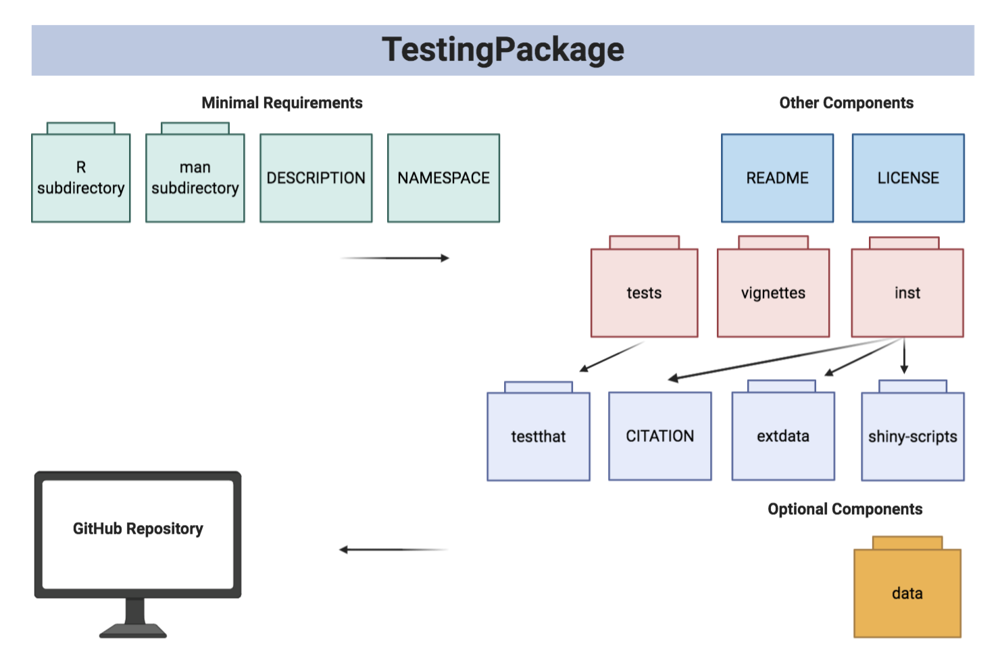

```{r setup, include=FALSE}
library(knitr)
opts_chunk$set(fig.align = "center", 
               out.width = "90%",
               fig.width = 6, fig.height = 5.5,
               dev.args=list(pointsize=10),
               par = TRUE, # needed for setting hook 
               collapse = TRUE, # collapse input & ouput code in chunks
               warning = FALSE)
knit_hooks$set(par = function(before, options, envir)
  { if(before && options$fig.show != "none") 
       par(family = "sans", mar=c(4.1,4.1,1.1,1.1), mgp=c(3,1,0), tcl=-0.5)
})
set.seed(1) # for exact reproducibility
```
       
## Introduction

`TestingPackage` is an R package developed to demonstrate components of a simple R package. This includes the main components: DESCRIPTION, NAMESPACE, man subdirectory and R subdirectory. Additionally, licence, README and subdirectories vignettes, tests, data and inst are also explored. The package is targeted for BCB410H students exploring development of an R package in bioinformatics. **This document gives a tour of TestingPackage (version 0.1.0)**. It was written in R Markdown, using the [knitr](https://cran.r-project.org/package=knitr) package for production. See `help(package = "TestingPackage")` for further details. 

To download **TestingPackage**, use the following commands:

``` r
require("devtools")
devtools::install_github("anjalisilva/TestingPackage", build_vignettes = TRUE)
library("TestingPackage")
```
To list all sample functions available in the package:
``` r
ls("package:TestingPackage")
```

To list all sample datasets available in the package:
``` r
data(package = "TestingPackage")
```

<br>

## Components

The minimal requirements of an R package is described, followed by other components that are required for the purpose of this course. 

<div style="text-align:center">

<div style="text-align:left">

### Minimal requirements

* The **R subdirectory** within an R package contains all the R code files or script files. These are files ending with ".R". 

* The **man subdirectory** contains help documentation for each function that is available to the user. Help files should be autogenerated via *roxygen2* package based on the roxygen tags used in the .R files from R subdirectory.

* **DESCRIPTION** file contains metadata, including the package name, the version number, the author and maintainer contact information, along with other information.

* **NAMESPACE** file provides a "context for looking up the value of an object associated with a name". This file will contain export(), import() and importFrom() statements. This file will be auto-updated via *roxygen2* package based on the roxygen tags used in the .R files from R subdirectory.

### Other

* **README** file mainly describes what the package does. For the purpose of this course, the following elements in order are required: 1. Description, 2. Installation, 3. Overview, 4. Contributions, 5. References, and 6. Acknowledgements. Any other content of student's choice should be placed after these six elements. 

* **LICENSE** file describing who can use the R package. 

* The **data** subdirectory with data (.rda) is included to demonstrate utility of functions in the package with this data. If data is included, proper documentation for data must be provided using data.R file. Including data in the R package, however, is optional. If not providing own data, must show examples with external datasets so user of the package can still understand utility of each function. 

* The **tests** subdirectory includes the testthat subdirectory, which has test that are written to see if functions are working as expected. There should be unit tests and integration tests. 

* The **vignettes** subdirectory permit to include vignettes for the R package. A vignette is a long-form tutorial to the package, which shows the applications of functions using a sample dataset. Explain the functions to the user, the purpose, show the output to the user and explain how to interpret the output to the user. Visuals should be included, if the application of the function is to generate a visual. You may include multiple vignettes for the package, but at least one vignette should be a long form tutorial showing applicability of all the functions in the package. Vignettes must end with *sessionInfo()*; attend lecture to understand why this is. 

* The **inst** subdirectory contains other files and subdirectories. **CITATION** file should be included here. Other subdirectories may include extdata and shiny-scripts. The **extdata** subdirectory can include images included in README file. The **shiny-scripts** subdirectory should include shiny script files (app.R). 

* The local project must be housed in a GitHub repository. There should be a record of the changes made to the package via Git commit messages. For the purpose of this course, ensure the **.Rproj** file is available on GitHub. Do NOT add it to .gitignore.

<br>

<div style="text-align:left">

<br>

## Applications
To get more information about *InfCriteriaCalculation* function, the help documentation will helpful too:
```{r, }
library(TestingPackage)
?TestingPackage::InfCriteriaCalculation
``` 

Here the function *InfCriteriaCalculation* is a function that calculates information criteria including Bayesian information criterion (BIC; Schwarz, 1978), Akaike information criterion (AIC; Akaike, 1973) and Integrated Complete Likelihood (ICL; Biernacki et al., 2000). To calculate these, the function should be provided with log-likelihood, the number of clusters, dimension of dataset, and the number of observations, and the probability.

As an example, let's use the *GeneCounts* dataset which has 30 observations and a dimensionality of 3, showing raw counts from an RNA sequencing dataset. Here, assume the log-likelihood is -5080, number of clusters being considered is 2, and the probability of the 2 clusters are 0.5 and 0.5. The output is saved into the R object *InfCriteriaResults*.


```{r, }
InfCriteriaResults <- TestingPackage::InfCriteriaCalculation(
                          loglikelihood = -5080,
                          nClusters = 2,
                          dimensionality = ncol(GeneCounts),
                          observations = nrow(GeneCounts),
                          probability = c(0.5, 0.5))
``` 

To access results, see:
```{r, }
# To get the class of InfCriteriaResults
class(InfCriteriaResults)

# To get names of InfCriteriaResults
names(InfCriteriaResults)
``` 

Here, InfCriteriaResults is an S3 object of class InfCriteria, which is a list containing results 'BICresults', 'AICresults' and 'ICLresults'. Let's take a look at each information criterion output, starting with 'BICresults'.

```{r, }
# To get details of BICresults
InfCriteriaResults$BICresults

# To get details of BICresults
InfCriteriaResults$AICresults

# To get details of BICresults
InfCriteriaResults$ICLresults

``` 

Here the BIC and ICL values are 10194.01, and the AICresults value is 10180. To visualize the results, you may use *InfCriteriaPlot* function. To read more about *InfCriteriaPlot* function, see:

```{r, }
library(TestingPackage)
?TestingPackage::InfCriteriaPlot
``` 

Let's create the plot of information criteria versus information criteria value. 
```{r, }
TestingPackage::InfCriteriaPlot(infValues = InfCriteriaResults)
``` 

The plot shows the information criterion on the x-axis and the information criteria value on the y-axis. Here, the values of BIC and ICL values are higher than that of AIC. 

## Package References

- Silva, A. (2022) TestingPackage: An Example R Package For
  BCB410H. Unpublished. https://github.com/anjalisilva/TestingPackage

<br>

## Other References

- Akaike, H. (1973). Information theory and an extension of the maximum likelihood principle. In *Second International Symposium on Information Theory*, New York, USA, 267–281. Springer Verlag. https://link.springer.com/chapter/10.1007/978-1-4612-1694-0_15.

- Biernacki, C., G. Celeux, and G. Govaert (2000). Assessing a mixture model for clustering with the integrated classification likelihood. *IEEE Transactions on Pattern Analysis and Machine Intelligence* 22. https://hal.inria.fr/inria-00073163/document

- BioRender. (2020). Image created by Silva, A. Retrieved October 30, 2020, from https://app.biorender.com/

- McCarthy, D. J., Chen Y. and Smyth, G. K. (2012). Differential expression analysis of multifactor RNA-Seq experiments with respect to biological variation. *Nucleic Acids Research* 40. 4288-4297.
https://pubmed.ncbi.nlm.nih.gov/22287627/

- R Core Team (2022). R: A language and environment for statistical computing. R Foundation for Statistical Computing, Vienna, Austria. https://www.R-project.org/

- Schwarz, G. (1978). Estimating the dimension of a model. *The Annals of Statistics* 6, 461–464. https://projecteuclid.org/euclid.aos/1176344136.

- Scrucca, L., Fop, M., Murphy, T. B. and Raftery, A. E. (2016) mclust 5: clustering, classification and density estimation using Gaussian finite mixture models. *The R Journal* 8(1), 289-317. 
https://www.ncbi.nlm.nih.gov/pmc/articles/PMC5096736/ 

- Wickham, H. and Bryan, J. (2019). *R Packages* (2nd edition). Newton, Massachusetts: O'Reilly Media. https://r-pkgs.org/

----

```{r}
sessionInfo()
```
